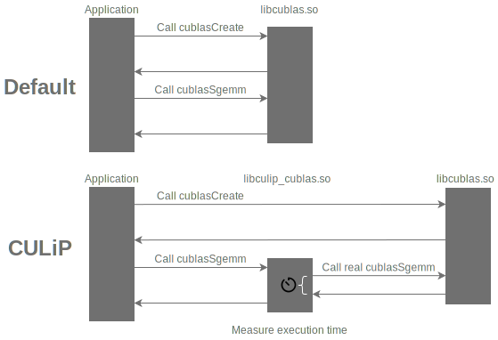

# CULiP - CUDA Library Profiler

CULiP is a library for profiling the execution time of CUDA official library functions

## Supported libraries and functions

- cuBLAS
  - `cublasDgemm`
  - `cublasSgemm`
  - `cublasHgemm`
  - `cublasGemmEx`

## Dependencies
- CUDA >= 10.0
- CMake >= 3.18
- C++ >= 14

## Usage

1. Clone CULiP
```bash
git clone https://github.com/enp1s0/CULiP
cd CULiP
```

2. Build
```bash
mkdir build
cmake .. -DCMAKE_INSTALL_PREFIX=/path/to/install/CULiP
make
make install
```

3. Link the CULiP libraries **before linking libcublas and so on**
```
nvcc main.cu -L/path/to/install/CULiP/lib -lculip_cublas -lcublas -o foo.bar
```

4. Execute the application
```bash
./foo.bar
```

Then the execution time is printed on stdout.
```
[CULiP Result][cublasSgemm_v2-m1024-n1024-k1024] 155182ns
```

To disable profiling at runtime, define an environment variable `CULIP_PROFILING_CUBLAS_DISABLE`.
```bash
# Disable cuBLAS profiling
export CULIP_PROFILING_CUBLAS_DISABLE=1

# Enable cuBLAS profiling
export CULIP_PROFILING_CUBLAS_DISABLE=0
# or
unset CULIP_PROFILING_CUBLAS_DISABLE
```

## Profiling control API

CULiP provides profiling control API.
By default, all profiling is enabled.

```cpp
// nvcc -I/path/to/install/CULiP/include ...
#include <CULiP/cublas.hpp>

// Disable profiling of all functions
CULiP_profiling_cublas_disable_all();

// Enable profiling of all functions
CULiP_profiling_cublas_enable_all();

// Disable profiling of a function (e.g. `cublasSgemm`)
CULiP_profiling_cublas_disable(CULiP_cublasSgemm);

// Enable profiling of a function (e.g. `cublasSgemm`)
CULiP_profiling_cublas_enable(CULiP_cublasSgemm);
```

## How it works



## License
MIT
